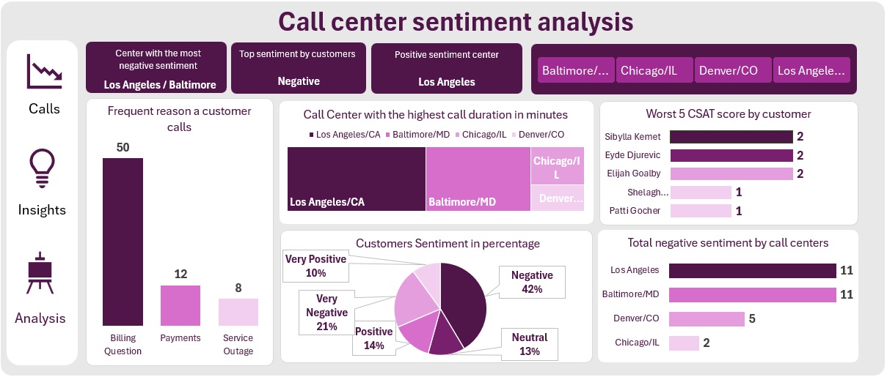

Markdown
# Call Center Sentiment Analysis Dashboard

## Dashboard Preview

---

## Project Overview
This project provides a comprehensive analysis of customer sentiment, call duration, CSAT (Customer Satisfaction) scores, and call drivers across multiple call center locations. The goal is to identify root causes of customer dissatisfaction, optimize support channels, and improve overall service efficiency.

* **Industry:** Customer Operations & Support / Telecommunications
* **Dataset Size:** 70 Call Records
* **Primary Focus:** Sentiment Analysis, CSAT Drivers, and Regional Performance

---

## Story of Data
Customer interactions across four main call centers (Los Angeles, Baltimore, Chicago, and Denver) were evaluated to assess customer satisfaction and service quality. 

The analysis reveals that **63% of all incoming calls express negative or very negative sentiment**, with **Billing Questions** accounting for the vast majority (50 out of 70 calls) of customer inquiries. While Los Angeles handles the highest overall call volume and duration, both Los Angeles and Baltimore experience the highest concentrations of negative customer feedback. Addressing billing clarity and streamlining automated response channels represent the highest priority levers for operational improvement.

---

## Stakeholder Interests (Why This Analysis Matters)
* **Call Center Operations Managers:** Identifies high-friction centers (Los Angeles & Baltimore) requiring workflow and staffing optimizations.
* **Customer Success Leadership:** Tracks low CSAT scores and negative sentiment drivers to reduce customer churn.
* **Billing & Finance Teams:** Highlights recurring billing inquiries so clear invoicing and automated self-service tools can be implemented.
* **Quality Assurance (QA) Teams:** Monitors call duration and SLA response performance across support channels.

---

## Key Performance Indicators (KPIs)
* **Top Overall Sentiment:** Negative (42% Negative + 21% Very Negative = 63% total negative tone)
* **Primary Call Driver:** Billing Questions (50 calls)
* **Centers with Most Negative Sentiment:** Los Angeles & Baltimore (11 negative calls each)
* **Top Performing Center (Positive Sentiment):** Los Angeles (Highest total positive/very positive volume)

---

## Key Insights & Analytical Findings

### 1. Customer Sentiment Distribution
* **Negative & Very Negative:** Account for **63%** of all customer interactions (42% Negative, 21% Very Negative).
* **Positive & Very Positive:** Account for **24%** of interactions (14% Positive, 10% Very Positive).
* **Neutral:** Represents **13%** of calls.

### 2. Main Reasons for Customer Calls
* **Billing Questions:** The overwhelming lead reason for calling with **50 calls** (71.4% of total volume).
* **Payments:** Second most frequent reason with **12 calls** (17.1%).
* **Service Outage:** Lowest volume with **8 calls** (11.5%).

### 3. Regional Call Center Performance
* **Highest Call Duration:** **Los Angeles/CA** and **Baltimore/MD** record the longest total call times.
* **Negative Sentiment Leader:** **Los Angeles** and **Baltimore** each recorded **11 negative sentiment calls**, compared to **Denver (5)** and **Chicago (2)**.

### 4. CSAT (Customer Satisfaction) Bottlenecks
* The lowest CSAT scores range from **1 to 2 out of 10**, driven primarily by customers experiencing recurring billing confusion and extended resolution times.

---

## Project Variables

### Categorical / Independent Variables
* **Call Center:** Support hub location (Los Angeles/CA, Baltimore/MD, Chicago/IL, Denver/CO).
* **Reason:** Primary call trigger (Billing Question, Payments, Service Outage).
* **Channel:** Communication medium (Chatbot, Call, Email, Web).
* **Response Time:** SLA classification (Within SLA, Below SLA).

### Numeric / Dependent Variables
* **CSAT Score:** Customer Satisfaction rating (1 to 10 scale).
* **Call Duration (Minutes):** Length of time spent handling the interaction.
* **Sentiment:** Customer emotional tone (Very Positive, Positive, Neutral, Negative, Very Negative).

---

## Tools & Techniques Used
* **Microsoft Excel:** Data cleaning, transformation, and structured formatting.
* **Pivot Tables & Calculated Fields:** Summarized metrics for sentiment splits, call durations, and CSAT scores.
* **Excel Formulas:** Aggregated counts, percentages, and performance rankings.
* **Interactive Dashboard & Slicers:** Built interactive visual components and location filters for executive reporting.

---

## Strategic Recommendations
1. **Optimize Billing Transparency:** Since 71% of calls stem from billing questions, update invoice layouts and send proactive billing notifications to reduce call volume.
2. **Implement Targeted Agent Coaching:** Provide specialized conflict resolution and de-escalation training for staff at the Los Angeles and Baltimore call centers.
3. **Enhance Automated Self-Service:** Train Chatbot and automated IVR systems to resolve routine payment and balance inquiries without requiring live agent intervention.
4. **Follow Up on Low CSAT Accounts:** Establish a dedicated QA outreach workflow for customers
